# BayPook

Booking and payments for Slimedom's slime-workshop and party venues (South Woodford and Lakeside), built to replace Wix behind the website's `/book` page. One admin for both venues, phone-first; Stripe Checkout with one Stripe account per venue; email confirmations with calendar attachments; a Google Calendar mirror; and a public API the website calls.

## Try it in two minutes (demo mode)

```bash
npm install
npm run demo
```

Then open http://localhost:3100/admin, click **Sign in as owner**. Demo mode runs an embedded Postgres under `.data/demo`, seeds Slimedom's venues and catalogue, fakes payments (a Pay / Decline page), writes every email to the **Outbox** page and every calendar push to the **Calendar log**. Nothing leaves your machine. `npm run demo:reset` wipes it.

The reference booking page is at http://localhost:3100/book (plain, functional, not the website's design). It uses the same `/api/v1` the website will use.

## Ten-minute demo walkthrough

1. `npm run demo`, then http://localhost:3100/login, **Sign in as owner**. Today shows both venues with sample bookings; use the date arrows or the Week tab.
2. Open http://localhost:3100/book in another tab. South Woodford, Classic Workshops, a Saturday, 14:00, two Slime Workshop places, your details, tick both boxes, **Pay**. The demo checkout appears: press **Pay**. The thanks page confirms with a reference.
3. Back in the admin: **More, Outbox** shows the confirmation email with its `.ics` attachment; **Bookings** lists the booking as Confirmed and Paid; Today shows the parent's name under the 14:00 session.
4. In `/book` try a Slime Party at the same time: that time is not offered (a booked workshop blocks the one room). Pick a time over empty sessions: it is offered, and those sessions then show as "Not available" on `/book` (reason `room_busy` in the API).
5. Start another booking and stop at the demo checkout (choose **Abandon**). After the hold length (15 minutes, Settings) **More, Jobs, Hold expiry, Run now** releases the places and cancels the pending booking.
6. Open the booking: give a part refund, move it to another time, change the places, resend the confirmation, add a note. **More, Audit log** records each step.
7. **Catalogue**: change the Slime Workshop price; the `/book` total and `GET /api/v1/venues/south-woodford/services` change at once.
8. Sign out and **Sign in as Lakeside staff**: only Lakeside is visible, South Woodford bookings are refused, and there is no refund button.
9. **Connections** shows every provider as Demo with the exact env var to set when going live.

## What it looks like

Phone-sized captures from the demo (390 × 844), plus the Week view on a desktop. Regenerate them with `SCREENSHOTS=1 npx playwright test tests/e2e/screenshots.spec.ts` (it starts the demo itself and makes its own sample bookings a few days ahead).

| | | |
|---|---|---|
| 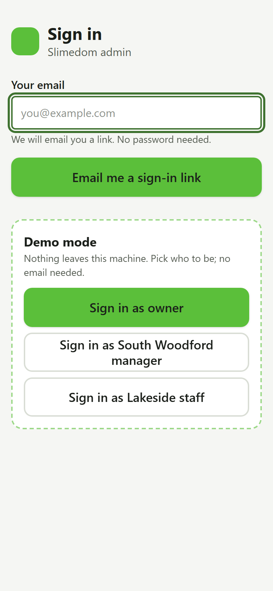 | 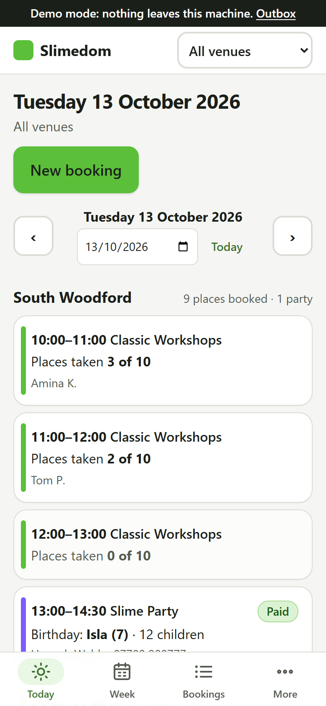 | 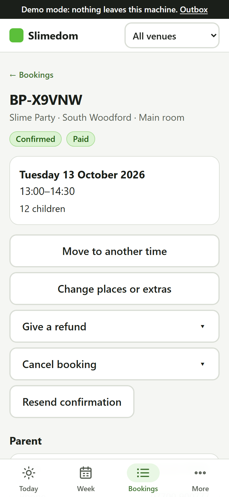 |
| **Sign in**: demo mode offers one-tap owner, manager and staff logins. | **Today**: both venues' sessions and parties for the day, with places taken. | **Booking**: status, money and every action on one page. |
| 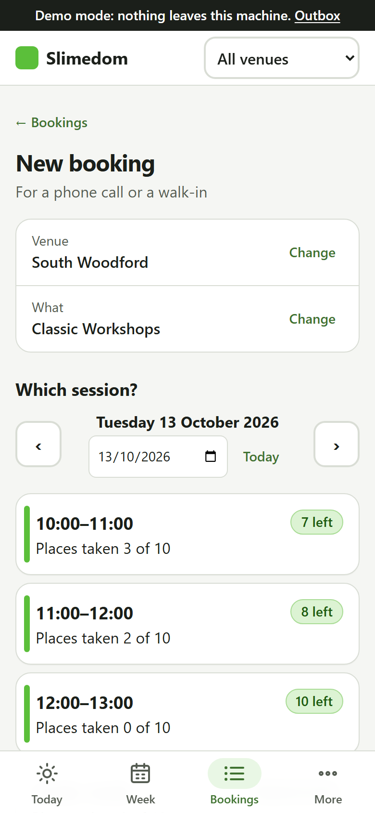 | 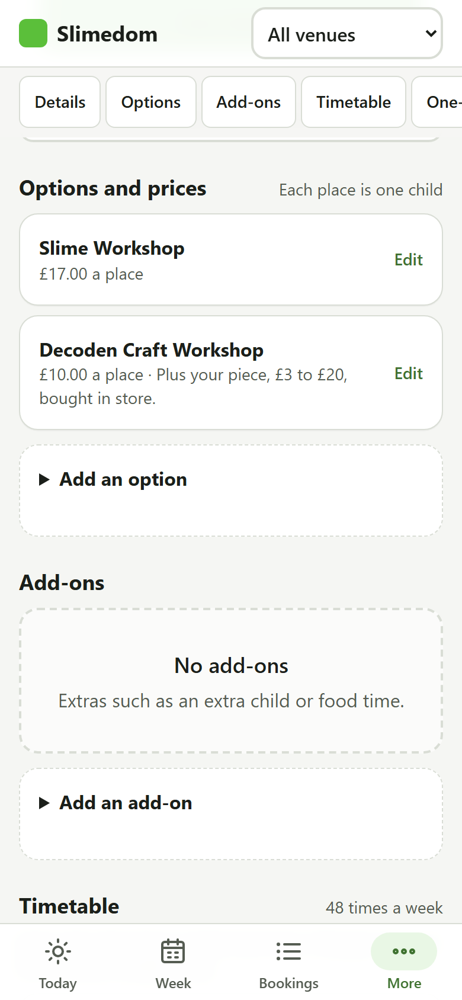 | 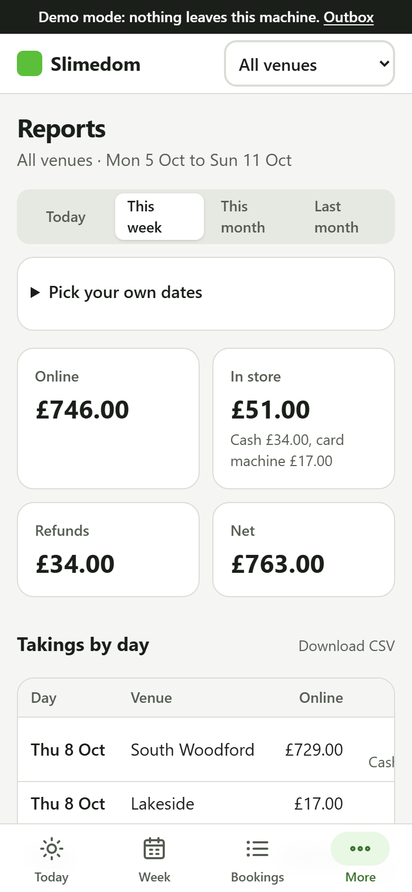 |
| **New booking**: the phone and walk-in wizard, choosing a session. | **Catalogue**: a service's details, options and prices, timetable. | **Reports**: takings online and in store, refunds, what is owed. |
| 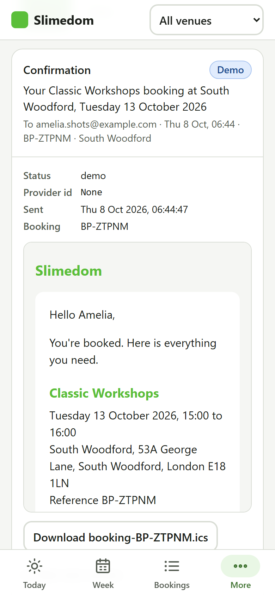 | 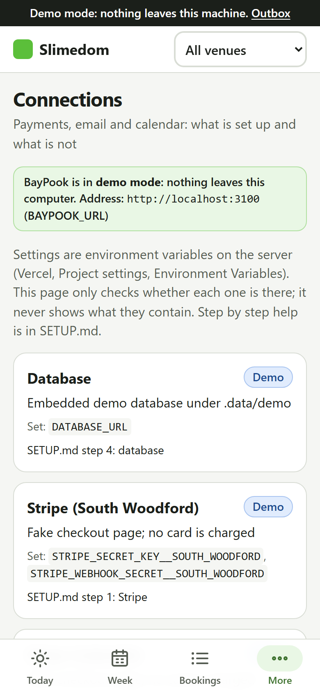 | 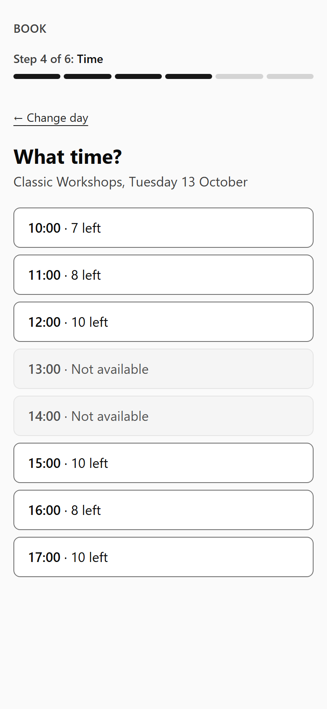 |
| **Outbox**: a confirmation email opened, with its `.ics` attachment. | **Connections**: each provider's mode and the env var to go live. | **`/book`, time step**: places left per session; times a party has taken are not offered. |
| 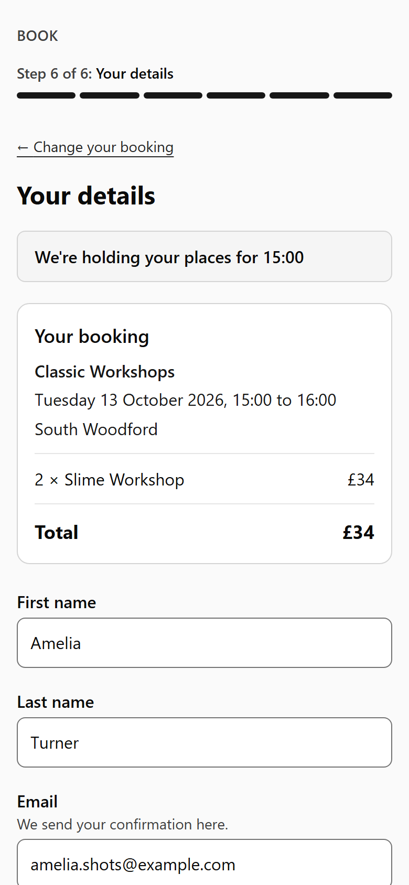 | 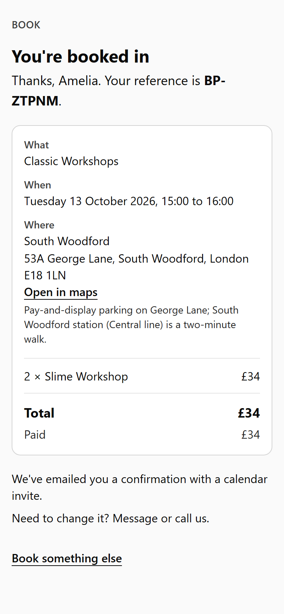 | |
| **`/book`, details step**: the held places and the total while the parent fills in their details. | **Thanks**: the reference, what was booked and what was paid. | |

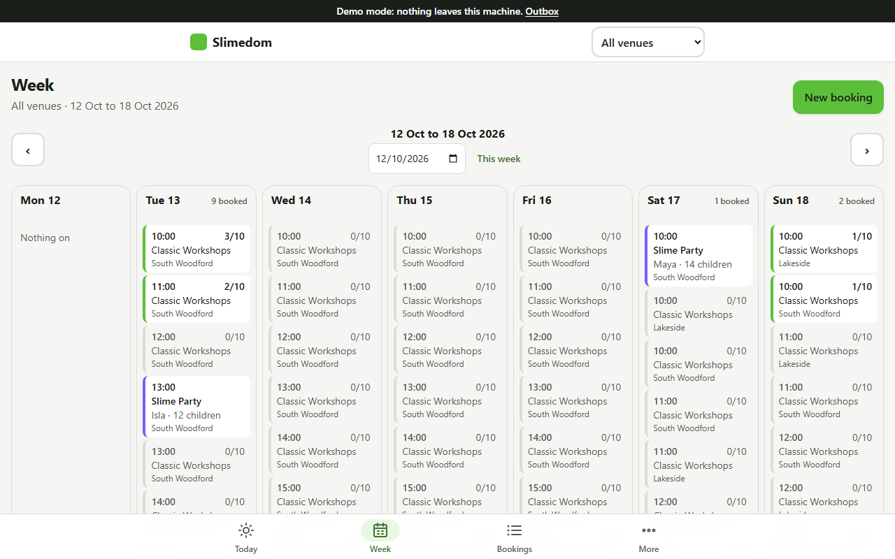

**Week** on a desktop: seven days side by side, workshops with places taken and parties with the birthday child.

## Going live

Read `SETUP.md`: Stripe keys and webhooks per venue, Resend DNS, a Google service account, a Neon database, Vercel env vars, cron and domains, then the first owner login. `INTEGRATION.md` explains the website switch.

## Repository map

```
src/app/(admin)/admin/   the admin UI
src/app/book/            the reference booking page
src/app/api/v1/          the public API (docs/API.md)
src/app/api/webhooks/    Stripe webhook per venue
src/app/api/cron/        hold expiry, reminders, retention (Vercel Cron, CRON_SECRET)
src/db/                  Drizzle schema, migrations, seed
src/core/                availability, pricing, state machine, timetable (pure, tested)
src/server/              database-backed services (holds, bookings, notifications, calendar, auth)
src/providers/           payment / email / calendar: interface + real adapter + demo adapter
src/client/client.ts     the typed client the website copies
tests/                   Vitest unit and API tests; Playwright smoke test in demo mode
scripts/                 demo launcher, seed, Wix CSV import
```

## Commands

| command | what |
|---|---|
| `npm run demo` | demo mode on port 3100 |
| `npm run dev` | live mode on 3000 (needs `.env.local`, see `.env.example`) |
| `npm run check` | typecheck + lint + unit tests |
| `npm run test:coverage` | unit tests with coverage of `src/core` |
| `npm run test:e2e` | Playwright smoke test (starts the demo itself) |
| `npm run db:generate` / `db:migrate` | Drizzle migrations |
| `npm run import:wix -- file.csv` | import future Wix bookings |

## Documents

- `docs/spec/` the requirements and build prompt
- `docs/API.md` the public API contract
- `DECISIONS.md` choices the spec left open
- `STATE.md` build checkpoint and final report
